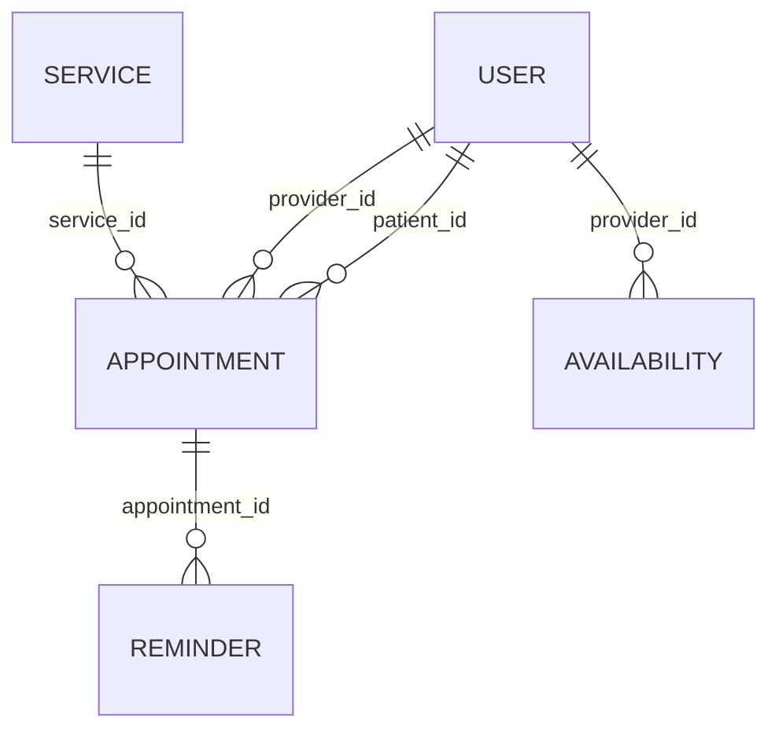

# Database Normalization Documentation

## Appointment Scheduling System


---

## 📋 Project Overview

This document outlines the database normalization strategy implemented for the **Appointment Scheduling System**, ensuring optimal data organization, integrity, and performance through adherence to **Third Normal Form (3NF)** principles.

**Project Details:**
- **Student:** Shema Christian
- **Course:** INSY 8311 – Database Development with PL/SQL
- **Date:** May 16, 2025

---

## 🎯 Normalization Objectives

Relational database normalization is a systematic approach to organizing tables and relationships that achieves:

- ✅ **Minimized Data Redundancy**
- ✅ **Prevention of Update Anomalies**
- ✅ **Enhanced Data Integrity**
- ✅ **Improved Consistency**
- ✅ **Simplified Maintenance**

---

## 🗂️ Database Schema Overview

### Core Tables Structure

| Table | Primary Key | Key Attributes |
|-------|-------------|----------------|
| **USER** | `user_id` | name, email, role |
| **SERVICE** | `service_id` | service_name, duration_minutes, price |
| **APPOINTMENT** | `appointment_id` | appointment_date, appointment_time, status, patient_id (FK), provider_id (FK), service_id (FK) |
| **REMINDER** | `reminder_id` | reminder_date, appointment_id (FK) |
| **AVAILABILITY** | `avail_id` | provider_id (FK), day_of_week, start_time, end_time |

---

## 🔍 Normalization Analysis

### 1️⃣ First Normal Form (1NF)

**Rule:** Tables must have a primary key and contain only atomic (indivisible) attribute values.

#### ✅ Compliance Validation:
- **Primary Keys:** Every table defines a single-column primary key ensuring unique row identification
- **Atomic Values:** All attributes store single, indivisible values
  - `USER.email` contains one email address per record
  - `SERVICE.duration_minutes` stores a single numeric value
  - No multi-valued attributes or repeating groups exist

#### Example:
```sql
-- ✅ CORRECT: Atomic values
USER Table:
user_id | name           | email                 | role
1       | John Smith     | john.smith@email.com  | Patient
2       | Dr. Jane Doe   | jane.doe@clinic.com   | Provider

-- ❌ INCORRECT: Non-atomic values (violates 1NF)
USER Table:
user_id | name           | emails                           | role
1       | John Smith     | john@email.com, john@work.com    | Patient
```

---

### 2️⃣ Second Normal Form (2NF)

**Rule:** Non-key attributes must be fully functionally dependent on the entire primary key (eliminates partial dependencies).

#### ✅ Compliance Validation:
- **Single-Column Primary Keys:** All tables use single-column primary keys, inherently preventing partial dependencies
- **Full Functional Dependency:** Every non-key attribute depends entirely on its table's primary key

#### Key Relationships:
```sql
-- APPOINTMENT table demonstrates full functional dependency
APPOINTMENT:
appointment_id → appointment_date, appointment_time, status, patient_id, provider_id, service_id

-- Each attribute describes the specific appointment identified by appointment_id
```

---

### 3️⃣ Third Normal Form (3NF)

**Rule:** Eliminates transitive dependencies - non-key attributes must depend only on the primary key, not on other non-key attributes.

#### ✅ Compliance Validation:

##### Service Information Separation
```sql
-- ✅ CORRECT: Service details in separate SERVICE table
SERVICE:
service_id | service_name    | duration_minutes | price
1          | Consultation    | 30              | 100.00
2          | Physical Exam   | 45              | 150.00

APPOINTMENT:
appointment_id | service_id | appointment_date | status
1              | 1          | 2025-05-20      | Confirmed
```

##### Reminder Data Isolation
```sql
-- ✅ CORRECT: Reminders separated to eliminate redundancy
REMINDER:
reminder_id | reminder_date | appointment_id
1           | 2025-05-19    | 1
2           | 2025-05-19    | 1  -- Multiple reminders for same appointment
```

##### Provider Availability Separation
```sql
-- ✅ CORRECT: Provider schedules in dedicated AVAILABILITY table
AVAILABILITY:
avail_id | provider_id | day_of_week | start_time | end_time
1        | 2          | Monday      | 09:00     | 17:00
2        | 2          | Tuesday     | 09:00     | 17:00
```

---

## 📊 Benefits of 3NF Implementation

### 🚀 Performance Benefits
- **Reduced Storage Requirements:** Elimination of duplicate data
- **Faster Query Performance:** Optimized table structures
- **Efficient Indexing:** Targeted index strategies

### 🔒 Data Integrity Benefits
- **Single Source of Truth:** Each fact stored in one location
- **Consistent Updates:** Changes propagate correctly
- **Referential Integrity:** Foreign key constraints maintain relationships

### 🛠️ Maintenance Benefits
- **Simplified Updates:** Modify data in one place
- **Reduced Anomalies:** Prevents insertion, update, and deletion anomalies
- **Scalable Design:** Easy addition of new entities without restructuring

---

## 🔗 Entity Relationships

### Primary Relationships


### Key Foreign Key Constraints
- `APPOINTMENT.patient_id` → `USER.user_id`
- `APPOINTMENT.provider_id` → `USER.user_id`
- `APPOINTMENT.service_id` → `SERVICE.service_id`
- `REMINDER.appointment_id` → `APPOINTMENT.appointment_id`
- `AVAILABILITY.provider_id` → `USER.user_id`

---

## 📈 Scalability & Future-Proofing

This normalized design provides:

### ✨ Extensibility
- **New Services:** Add to SERVICE table without affecting existing appointments
- **Additional User Roles:** Extend USER table role attribute
- **Enhanced Reminders:** Expand REMINDER functionality independently

### 🔧 Maintenance Efficiency
- **Schema Evolution:** Modify individual tables without cascading changes
- **Data Migration:** Simplified data transfer and backup processes
- **Performance Tuning:** Optimize specific tables based on usage patterns

---

## 🎉 Conclusion

The implementation of **Third Normal Form (3NF)** in our Appointment Scheduling System delivers:

| Benefit | Impact |
|---------|--------|
| **Data Redundancy** | ❌ Eliminated |
| **Update Anomalies** | ❌ Prevented |
| **Data Integrity** | ✅ Ensured |
| **System Scalability** | ✅ Enhanced |
| **Maintenance Complexity** | ✅ Reduced |

This robust normalized foundation enables:
- Reliable PL/SQL procedure implementation
- Efficient trigger mechanisms
- Comprehensive audit trail systems
- Optimal database performance

---

## 📚 Technical Implementation

### Database Platform
- **RDBMS:** Oracle Database
- **Development Language:** PL/SQL
- **Normalization Level:** Third Normal Form (3NF)
- **Design Methodology:** Entity-Relationship Modeling

### Next Steps
1. **Physical Database Implementation**
2. **PL/SQL Procedure Development**
3. **Trigger Implementation**
4. **Audit System Integration**
5. **Performance Optimization**

---

*This documentation serves as the foundation for the complete database implementation of the Appointment Scheduling System, ensuring adherence to industry best practices.*
